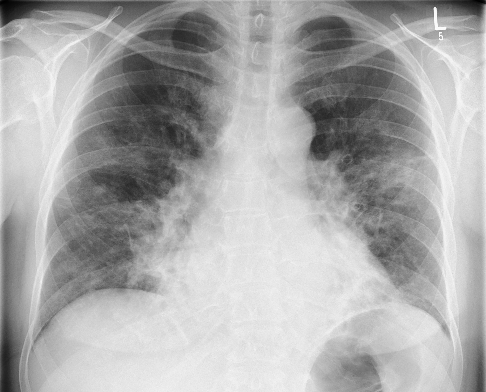
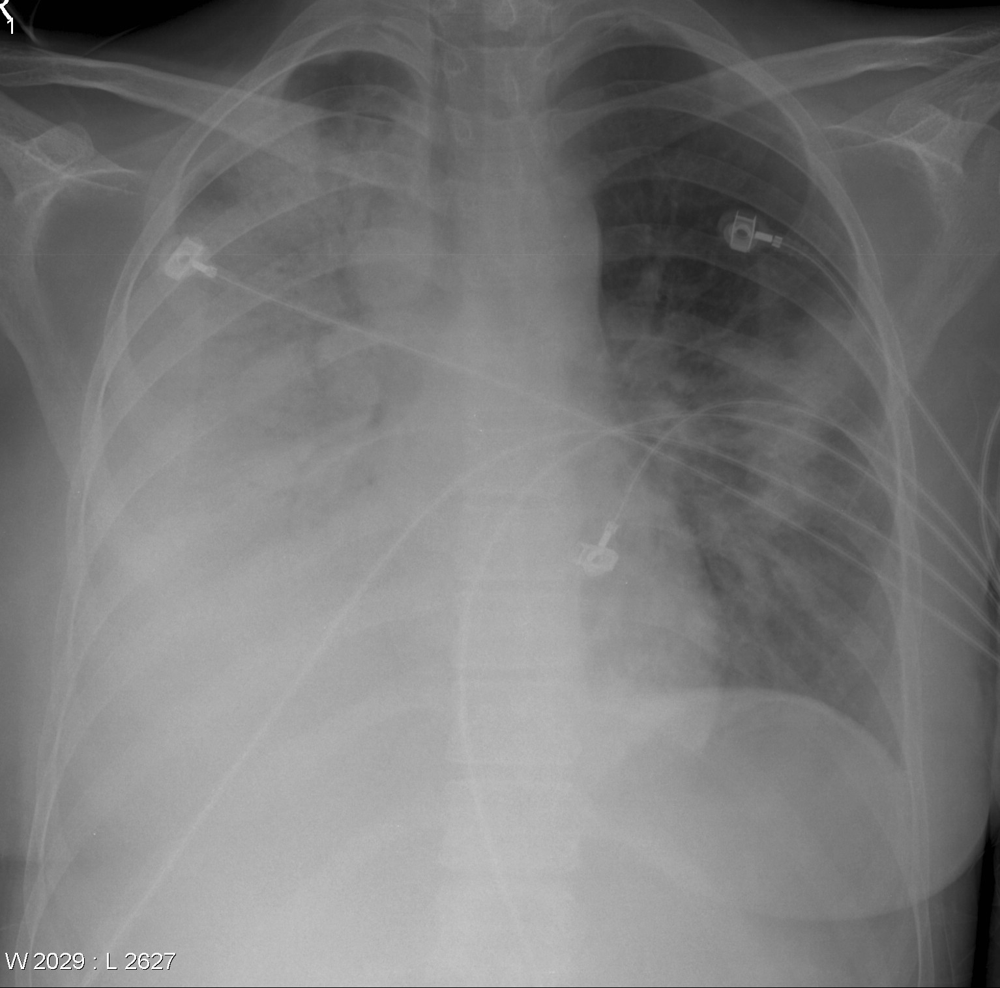
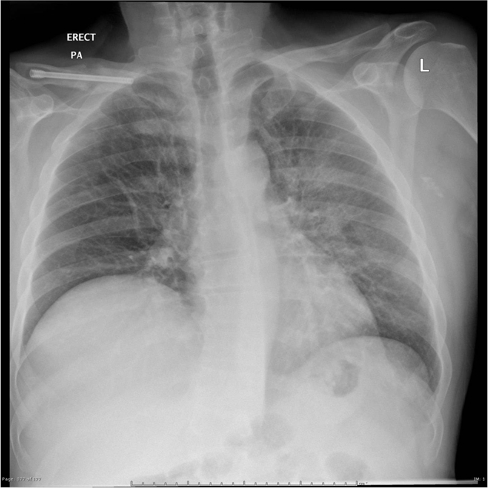
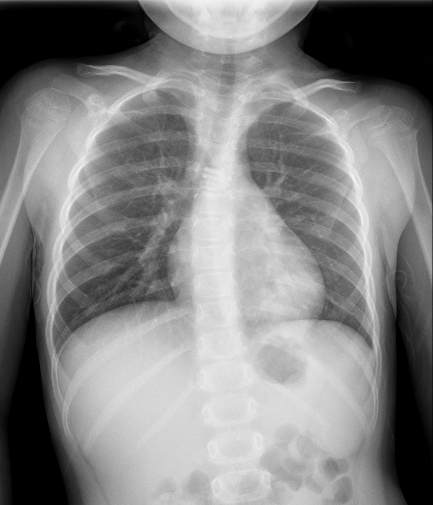
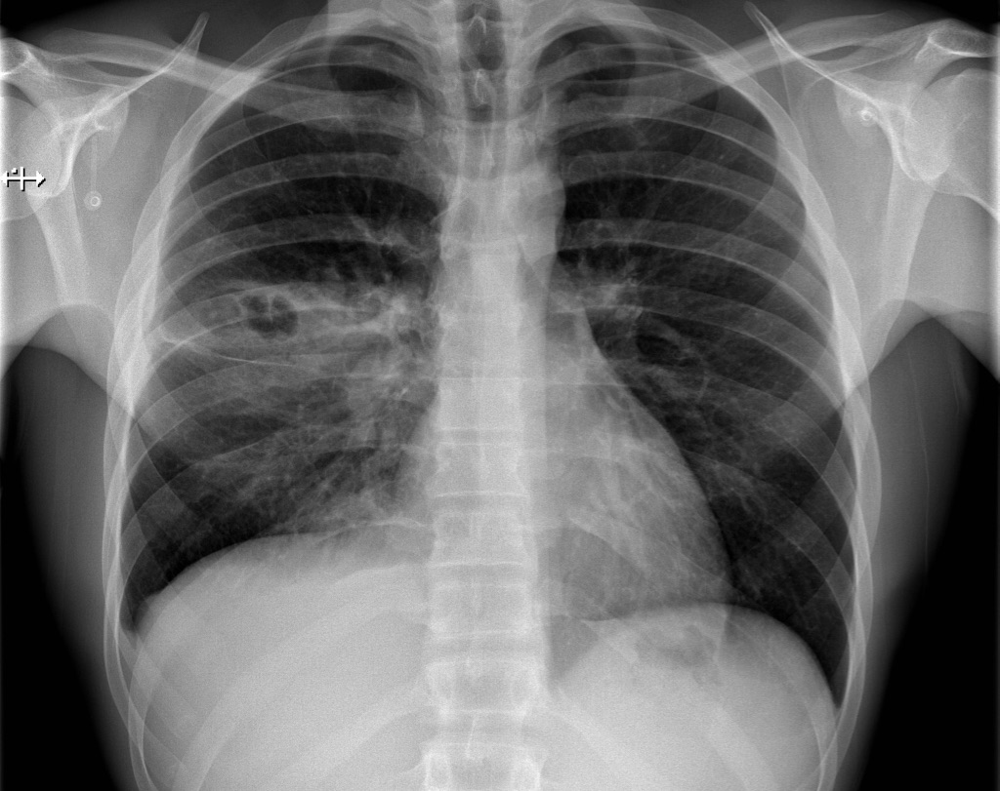

# Chest X-Ray Images (Pneumonia) :satellite:

## Abstract :book:

This dataset, available on [Kaggle](https://www.kaggle.com/datasets/paultimothymooney/chest-xray-pneumonia) and [Data Mendeley](https://data.mendeley.com/datasets/rscbjbr9sj/2), includes 5,860 chest X-Ray images categorized into two categories: Pneumonia and Normal. These images are further separated into bacterial and viral pneumonia sets using labels derived from their filenames. The initial model will train a Convolutional Neural Network (CNN) to classify images as either "pneumonia" or "normal". Subsequently, a second CNN will be trained to further distinguish between "bacterial pneumonia" and "viral pneumonia".

## Dataset Information :globe_with_meridians:

  
 Dataset Structure 

The dataset is organized into three primary folders:
- train, validate, and test.

For the first model:
- We will access the subfolders named NORMAL and PNEUMONIA from the chest_xray directory.

For the second model:
- We will access the subfolders named bacterial_pneumonia, viral_pneumonia, and normal from the data directory.

## Goal :dart:
The goal of this project is to automatically classify X-Ray images into three categories: "Normal", "Viral Pneumonia" and "Bactrial Pneumonia".

## Acquire :inbox_tray:
When you run the notebook, it automatically downloads and sorts the ChestXRay2017 dataset from [Data Mendeley](https://data.mendeley.com/datasets/rscbjbr9sj/2). The original files reside in the "chest_xray/train" and "chest_xray/test" directories. These files will be further sorted to differentiate viral from bacterial pneumonia images, subsequently organized into train, validate, and test sets. The validation data is generated from the training dataset.

## Data Dictionary
| Term                       | Description |
|:---------------------------|:------------|
| Alveoli                    | Tiny air sacs at the end of bronchioles in the lungs where the exchange of oxygen and carbon dioxide occurs. |
| Bronchioles                | Smaller branches of the primary bronchi leading to the alveoli. |
| Consolidation              | An area of the lung where air spaces (alveoli) are filled with pus, fluid, or other substances. |
| Ground-Glass Opacity (GGO) | A hazy area seen on a chest X-ray or CT scan. It indicates partial filling of air spaces in the lungs by exudate or transudate, as well as interstitial thickening or partial collapse of lung alveoli. |
| Hila (or Hilum)            | The central region of the lungs where blood vessels, bronchi, and nerves enter and exit. |
| Interstitial               | Referring to or situated between parts or in the interspaces of a tissue. In the context of the lung, it pertains to the tissue and space around the alveoli. |
| Lobes                      | Divisions of the lungs. Humans have three lobes in the right lung and two in the left. |
| Mediastinum                | The central compartment of the thoracic cavity surrounded by loose connective tissue. It houses the heart, trachea, esophagus, and several other structures. |
| Parenchyma                 | The functional tissue of an organ, as opposed to the connective or supporting tissue. In the context of the lung, it refers to the alveoli and bronchioles. |
| Pleura                     | Thin membranes, one covering the lung (visceral) and the other lining the chest cavity (parietal), which lubricate and cushion the lungs during respiration. |
| Pleural Effusion           | An abnormal accumulation of fluid in the pleural space between the lung and the chest wall. |
| Pulmonary                  | Related to the lungs. |
| Radiolucency               | An area on a radiograph that appears darker because more X-rays pass through, typically indicating less dense tissue or air. |
| Radiopacity                | An area on a radiograph that appears lighter due to X-rays being absorbed or deflected, typically indicating denser tissue or foreign material. |

## More information:

    
 Pneumonia 

    
Pneumonia is an infection of the air sacs in one or both lungs. The air sacs may fill with fluid or pus (purulent material) which limits their ability to take in oxygen or expel carbon dioxide. A variety of infective agents can cause pneumonia including: bacteria, viruses and fungi. Viral pneumonia is usually mild and goes away on its own but can progress into bacterial pneumonia. Fungi pneumonia is less common. It usually occurs in people with chronic health problems or weakened immune systems and is not identified in this dataset. 

- [Pneumonia](https://medlineplus.gov/pneumonia.html)
- [Viral Pneumonia](https://www.webmd.com/lung/viral-pneumonia)
- [Bacterial Pneumonia](https://www.webmd.com/lung/bacterial-pneumonia)
- [Types of Pneumonia](https://www.webmd.com/lung/pneumonia-types)

[Bronchitis](https://www.healthline.com/health/bronchitis-vs-pneumonia#similarities-differences) is a similar condition which results in inflamed bronchial tubes that usually produce mucus. While bronchitis is often less severe, it can develop into pneumonia.

    
 Chest X-Ray 

Chest X-rays are employed for various diagnostic purposes, one of which is the detection of pneumonia. The procedure involves positioning a film or sensor on one side of the object (in this case, the chest cavity) and a shielded x-ray source on the opposite side. When the source is briefly activated, it emits high-energy electromagnetic radiation, akin to visible light. This radiation traverses the object and gets captured by the film or sensor. The interaction of X-rays with the film results in its darkening or "exposure". 
 
As X-rays pass through the body, their trajectory and intensity are influenced by the density of the matter they encounter. This phenomenon is known as [Compton Scattering](https://www.nde-ed.org/Physics/X-Ray/comptonscattering.xhtml). Denser materials cause more scattering, meaning fewer X-rays reach the film or sensor. Consequently, areas on the film or sensor that absorb abundant X-rays appear black, while those receiving fewer X-rays appear white. This variance is termed contrast, enabling visualization of softer tissues like skin and muscle in darker gray shades and denser substances such as bones and metal in lighter gray tones. In the context of pneumonia, the accumulation of mucus in the lungs will scatter more X-rays, causing the affected regions to appear lighter compared to areas filled predominantly with air. 
 
For a deeper dive into the interpretation of chest X-rays: 
[Radiology Website](https://radiologyassistant.nl/chest/chest-x-ray/lung-disease)

    
 Pneumonia in chest x-rays 

    
Chest X-rays are not the sole diagnostic tool for pneumonia. They provide a segment of the complete diagnostic picture. Here's how various types of pneumonia can manifest in chest X-rays:

* 

    
Viral pneumonia

    [Viral pneumonia](https://radiopaedia.org/articles/viral-respiratory-tract-infection-1?lang=us) often displays an interstitial pattern on chest X-rays, marked by a delicate reticular (net-like) appearance. This stems from inflammation in the tissue between the air sacs. There might also be indications of peribronchial thickening, yielding a "hazy" or "ground-glass" look in the lungs. Notable viruses causing this manifestation include influenza, respiratory syncytial virus (RSV), and SARS-CoV-2. Although these alterations are typically bilateral and widespread, they tend to be subtler than those seen in bacterial pneumonia.
    
    Image: 
    
    Credit: [Case](https://radiopaedia.org/cases/75217?lang=us) courtesy of Joachim Feger
  

* 

    
Bacterial pneumonia

    [Bacterial pneumonia](https://radiopaedia.org/articles/bacterial-pneumonia?lang=us) often results in an alveolar or 'air-space' pattern on chest X-rays. This is characterized by areas of increased opacity (whiteness) indicating consolidation, where the alveoli are filled with inflammatory cells and exudate. The borders of the heart and diaphragm might be obscured in the region of consolidation, a phenomenon known as 'silhouette sign'. The predominant pathogens include Streptococcus pneumoniae, Haemophilus influenzae, and Klebsiella pneumoniae. The consolidation can involve an entire lobe (lobar pneumonia) or appear as patchy areas across multiple lobes.
    
    Image: 
    
    Credit: [Case](https://radiopaedia.org/cases/29090?lang=us) courtesy of Jack Ren
  

* 

    
Atypical pneumonia

    [Atypical pneumonia](https://radiopaedia.org/articles/atypical-pneumonia?lang=us) though similar in presentation to bacterial pneumonia, is induced by different bacterial strains. On X-rays, opacities are predominantly situated near the chest's center, around regions where blood enters and exits the lungs. This pneumonia variant is most frequently contracted outside healthcare facilities, making it prevalent among the general population.
    
    Image: 
    
    Credit: [Case](https://radiopaedia.org/cases/21993?lang=us) courtesy of Royal Melbourne Hospital Respiratory.
    
  

* 

    
Round pneumonia

    [Round pneumonia](https://radiopaedia.org/articles/round-pneumonia-1?lang=us) is predominantly seen in pediatric patients. They are well defined, rounded opacities that represent regions of infected consolidation. The infective agent in round pneumonia is bacterial. The leading bacterial cause is streptococcus pneumoniae. It shows up on X-rays as a round-ish opacity, distinct from the surrounding tissue. Most cases occur in the upper parts of the lungs' lower lobes.

    Image: 

    [Video](https://youtu.be/taImIMRBLFk) describing what to look for in the chest x-ray.
  
    Credit:
    
    [Case](https://radiopaedia.org/cases/round-pneumonia-23?lang=us) courtesy of Ryan Thibodeau

  

* 

    
Cavitating pneumonia

    [Cavitating pneumonia](https://radiopaedia.org/articles/cavitating-pneumonia?lang=us) is a rare complication and associated with severe illness. Pediatric cases are most commonly caused by Streptococcus pneumoniae. It shows up on X-rays as darker spots or 'holes' that appear over the regular lung tissue. These darker spots indicate areas where the lung tissue has been damaged or lost due to the infection.

    Image: 

    [Video](https://www.youtube.com/watch?v=jtwOSdAH5sM)
    
    Credit:

    [Case](https://radiopaedia.org/cases/54686?lang=us) courtesy of Callum Smith
  

* 

    
Hemorrhagic pneumonia

    [Hemorrhagic pneumonia](https://radiopaedia.org/articles/haemorrhagic-pneumonia?lang=us) is a severe form of pneumonia where bleeding occurs within the lung parenchyma. On chest X-rays, it can manifest as areas of increased opacity, similar to consolidations seen in bacterial pneumonia. However, the distinct feature is the rapid progression and the presence of a dense, 'ground-glass' appearance indicating blood filling the alveoli. The areas of hemorrhage can be widespread or focal. Common pathogens causing hemorrhagic pneumonia include Staphylococcus aureus, especially the MRSA strain, and Klebsiella pneumoniae. It's essential to identify and treat this type swiftly due to its potential for rapid deterioration.
    
    *No available image.*

  

## Resources:

- [Radiopaedia](https://radiopaedia.org/?lang=us)
- [Radiology Assistant](https://radiologyassistant.nl/)

